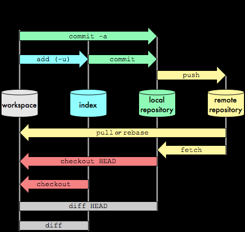
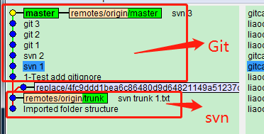
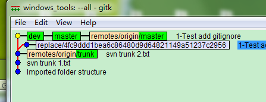
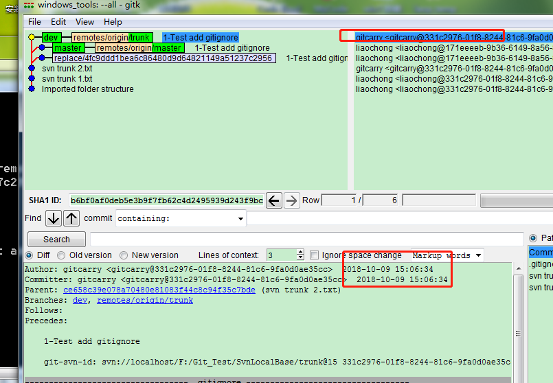
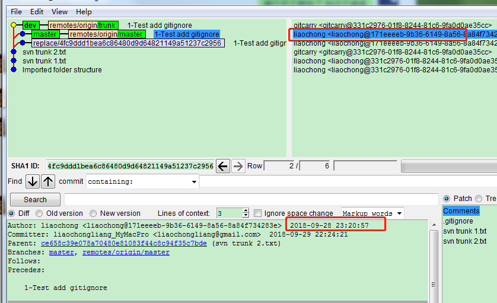


  
  
记录一些常用的GIT命令先来2个网上找的原理图，方便理解。  
本质上GIT是多颗树  
`workspace` 			一个是本地工作区  
`index`					一个是本地暂存区，也就是我们add但是还未commit的  
`Local repository`		一个是本地历史提交记录仓库。涵盖了我们在本地的所有提交  
`Remote repository`		最后一个就是，远端的代码仓库区

# 一些参考链接
>https://backlog.com/git-tutorial/cn/stepup/stepup7_1.html  
http://www.ruanyifeng.com/blog/2014/06/git_remote.html  
[Git-工具-重置揭密](https://git-scm.com/book/zh/v2/Git-%E5%B7%A5%E5%85%B7-%E9%87%8D%E7%BD%AE%E6%8F%AD%E5%AF%86)  
[Git-Replace](https://git-scm.com/book/zh/v2/Git-%E5%B7%A5%E5%85%B7-%E6%9B%BF%E6%8D%A2)  
[git简单命令](https://blog.csdn.net/zhangskd/article/details/8950939)  
[1 Git 与其他系统 - Git 与 Subversion](https://git-scm.com/book/zh/v1/Git-%E4%B8%8E%E5%85%B6%E4%BB%96%E7%B3%BB%E7%BB%9F-Git-%E4%B8%8E-Subversion)
# 标准流程
```
git status			//查看未提交到本地仓库的文件
git checkout			//查看和原创仓库的差异情况
git log --graph --oneline
git log --pretty=oneline
git log --oneline
git fetch
git checkout 			//查看差异情况
git diff mater origin/master  	//查看细节差异
git  merge origin/master  	//merge到本地
```

# 基本的操作
- vim操作
    ```shell
    ESC: wq!
    ```
- 查看远程仓库地址
     ```shell
    git remote -v  
    git remote show origin
    ```
    
- 创建并切换分支
    ```shell
    git branch -b  newbxxx oldxxx
    ```

- 切换分支  
    
    ```shell
    git checkout  master
    git checkout newxxx
    ```

- 删除分支
      
    ```shell
    git branch -d deltexxx
    ```

- 查看分支
    ```shell
    git branch -avv(-vv)
    ```
- 重命名本地分支
    ```shell
    git branch -m old new
    ```

- stash 误drop时
    ```shell
    git fsck
    git show  commitid
    git stash apply commitid
    git gc //手动clean
    ```


- 回滚当前分支所有修改`修改workspace`  
    - git reset --hard HEAD  //会删除本地的修改  
    - 如果只是需要回滚 add commit不用使用--hard。

- 注意如果需要修改 `Remote repository` 
    - 一般都是 push -f。。 多人协作会有问题  
    - git reset --hard HEAD~1  //回滚当前分支某个提交   
    - git push master -f  //因为落后远程库一个版本需要强制提交		
    - 多人协同时，比较安全的是revert，本质上会产生一次额外的提交，进而回滚某次提交	


- 提交远程分支，用于mr
git push origin  本地分支:远程分支
git push origin  maste_TTwebview:maste_TTwebview

- 查看git追踪的对象
git ls-files

- gitignore相关
```
1. 空行或是以#开头的行即注释行将被忽略。
2 /build 紧紧屏蔽buil   build/ 递归忽略所有
3 可以使用!来否定忽略，即比如在前面用了*.apk，然后使用!a.apk，则这个a.apk不会被忽略。
4 *用来匹配零个或多个字符，如*.[oa]忽略所有以".o"或".a"结尾，*~忽略所有以~结尾的文件（这种文件通常被许多编辑器标记为临时文件）
5 [].用来匹配括号内的任一字符，如[abc]，也可以在括号内加连接符，如[0-9]匹配0至9的数；?用来匹配单个字符。
```

# 高级操作

- 多个分支merge合入主线，GITlog 记录好看一点  
    >多个分支何如到master时，先merge一个，然后rebase  
    git checkout master  
    git merge issue2  
    git checkout issue3  
    git rebase master  
    git add myfile.txt  //修改冲突后手动add
    git rebase —continue (—abort)  
    注意这里可以加上merge的时候可以加上一个 --no--ff [参考链接](https://nvie.com/posts/a-successful-git-branching-model/) 

- 如果想维护history的线性,想维持树的整洁
    >每次提交前，先git fetch   
    然后如果commit有冲突.在不用-f的前提下  
    在git push之前  
    先git fetch  
    再git rebase  
    git fetch origin master  
    git rebase origin/master  
    git push  

- 删除上一次`远程仓库`的提交，修改上次提交的代码，做一次更完美的commit。
    >git reset commitId （注：不要带–hard）到上个版本  
    git stash 暂存修改  
    git push --force 强制push，远程的最新的一次commit被删除  
    git stash pop 释放暂存的修改，开始修改代码  
    git add . -> git commit -m "massage" -> git push  


- 针对本地、删除某一次也是类似  
    >git rebase -i ‘commit id'^　　　//弹出的窗口中 删除不要的pick  
    git push master -f	//remote 才需要

- 针对本地 修改历史某次提交  
    >git rebase -i ‘commit id'^　　　//弹出的窗口中pick改成Edit  
    git add .  
    git commit --amend  
    git rebase --continue      

- 修改本地最近一条commit记录  
    >git commit --amend  即可  
    git reset HEAD@{1} //回滚错误的修改  
    git reflog 	   //查看历史
# svn  GIT 互相转换
- svn 转到 GIT管理，不想丢失之前的commit记录
    >通过 git svn clone urlxxx 
    //新建分支，用GIT开发  
    git checkout -b dev   
    
    >//只保留一次提交到SVn  
    git checkout master  
    git svn rebase  
    git merge dev  
    git svn dcommit  
    
    >//保留dev的提交记录  
    git checkout master  
    git merge dev  
    git svn rebase  
    git svn dcommit  
    
# 本地SVN地址转到GIT  

创建SVN本地库(安装SVN Setup-Subversion-1.6.16.msi)，GUI右键操作 or命令行 avnadmin create SvnLoaclBase    
1.取地址 file:///F:\Carry_Blog\SvnLoaclBase 此链接可以checkout的。即建立本地svn服务器。  
2.如果我们想把SVN的历史提交记录，都放到git上  
3.切换到一个空的文件夹，git svn init  svn://localhost\F:\Carry_Blog\SvnLoaclBase 然后执行 git svn fetch。  
等价于 git svn clone。注意这个svn:://localhost协议，默认不会开启。 需要我们临时手动运行下 svnserve.exe --daemon  
4.后续可以在GIT上正常修改，当GIT修改要同步到SVN时，需要调用 git svn dcommit就可以把git的修改记录，提交到SVN 
5.注意这里可能会出错，需要修改 F:\Carry_Blog\SvnLoaclBase\conf\svnserve.conf 增加 anon-access = write  
6.当SVN有改动时，git svn fetch 即可 手动fetch后，需要merge到master。  
    简单点的做法是开发在dev线上，然后切换到master，执行git svn rebase。  
    如果Git有改动，需要把dev的改动merge到master。  
    然后用git svn dcommit提交到SVN的服务器。  
    注意首次需要加上name git svn dcommit –-username Gitcarry    
7.git commit --amend --author="Gitcarry\<liaochongliang@gmail.com\>"  //git svn 方式创建的GIT 总是不识别username  
8.提交到本地时,F:\Carry_Blog\SvnLoaclBase\conf\svnserve.conf 按前面7的设置，会导致 git svn dcommit 提交到SVN时，显示都是无name的所以。这里需要设置为SVN仓库是匿名不可写，然后在passwd中加上Gitcarry = 123456  设置文件在Tools\GitStudy\Svn_Begain.zip 中有一份例子
    
# GIT转SVN
1.首先我们有一个GIT的远程仓库，拉取到本地现在我们想把远程的GIT仓库和一个本地的SVN库，关联起来  
2.首先和上面一样，也需要创建一个SVN的本地仓库 获得地址 svn://localhost\F:\Git_Test\SvnLocalBase  
3.在本地拉取远端的git仓库  git clone https://github.com/liaochongliang/windows_tools     
4.接着运行 git svn init -s svn://localhost/F:/Git_Test/SvnLocalBase/  
5.拉取SVN的代码 git svn fetch  
6.此时git branch -avv 可以看到 我们有2个远程地址，一个是GIT的 一个是SVN的，而且这2个分支没有关联起来，所以不能merge等各种操作。  
7.git\info\grafts git第一个提交ID SVN最后一个提交ID (系统会提示要我们在运行一次git replace --convert-graft-file)  
强制把GIT的提交放到avn之后，让2个没有任何关系的分支有关联。  
这样就可以remote/git-svn remoter/master 之间各种merge 各种dcommit，只要建立了映射就很简单了。  
这里可以理解为，我们git仓库有个远端在github上，同时有一个远端是来自svn的URL（只不过我们这里用的本地）。  
为什么要这么做？主要是SVN查看历史记录和diff，习惯一点。  
当然用https://github.com/liaochongliang/lcl/tree/master/Tools/git 这个里面的\cmd\gitk.exe \cmd\git-gui.exe 也是很清晰的。    
  
8.到现在为止，我们的GIT有SVN本地仓库，也有远端的库。    
9.当我们修改GIT时，可以merge 到 remotes/git-svn,然后git svn dcommit.    
10.当我们修改SVN时，可以svn fetch,然后git merge 到对应的线.    
11.这里要注意维护提交记录的问题，就是前面有讲的，如何让提交历史更好看。注意：git svn dcommit 会修改本地的GIT提交hash值，这个没法优化。   
  

  
可以看到git的提交时间和人员，会被重新生成新的然后提交给svn，此时git diff dev master 是一致的  

```
所以需要遵守，以下规范  :
合入SVN修改(master) git rebase remotes/git-svn  解决冲突 然后 git rebase remotes/orign/master  
合入GIT修改(svn) git svn rabase  , git rebase master  解决冲突 然后 git remotes/git-svn   
也就是说SVN 和 remotes/git-svn 一直处于线性关系， master 和 remotes/orign/master 一直处于线性关系。  
这样就不会混。每次同步前后git diff确认下。
```
12.如何把修改，提交到SVN分支  (这个问题等价于,把GIT本地修改，提交到GIT svn命令自动生成的远端分支)  
假设SVN有分支remotes/origin/svn-B1  
本地有分支dev1 (remotes/origin/svn-B1)  
把本地修改推送到远端SVN,需要使用rebase  
git rebase remotes/origin/svn-B1 然后在 git svn dcommit  
向SVN提交时，会改变hash值，所以，如果有改动要同步，一定是先提交给SVN，在提交给GIT。  
注意SVN中删除一个分支，实际上不会影响文件。但是GIT删除会影响。  
删除无效的SVN远端分支  git branch -D -r remoter/origin/svn-B1  
删除文件 F:\Git_Test\windows_tools\.git\svn\refs\remotes\origin\svn-B1  

13.怎么重命名这个svn的分支？   
修改 .git\config如下，删除.git里面其他地方的文件即可  
[svn-remote "svn"]  
	url = svn://localhost/f:/git_test/windows_tools_svnlocalbase/  
	fetch = `trunk`:refs/remotes/`svn-trunk-xx`  

```
git clone https://github.com/liaochongliang/windows_tools
cd windows_tools
git svn init -s svn://localhost/F:\Git_Test\windows_tools_SvnLocalBase
git svn fetch
echo 4fc9ddd1bea6c86480d9d64821149a51237c2956 61fffa86bb8bd94e5dcc28b5cf296b2a3cf8590a >>.git/info/grafts
git replace --convert-graft-file
```


    
# windows cmd 显示中文问题  
- 设置操作
    >\*\\depot_tools\\win_tools-2_7_6_bin\\git （本GIT中 Tools\\git） 中打开git-bash.exe 
    右键属性  Text → locale设置为zh_CN  Character set 设置为 UTF-8  
    git config --global core.quotepath false   
    git config --global gui.encoding utf-8  
    git config --global i18n.commit.encoding utf-8   
    git config --global i18n.logoutputencoding gbk   
    export LESSCHARSET=utf-8 //导入到windows环境变量  
    //最后一条命令是因为 git log 默认使用 less 分页，所以需要 bash 对 less 命令进行 utf-8 编码
- 其他
    >另外https://github.com/liaochongliang/lcl/tree/master/Tools/git 是一个绿色版本的GIT  
    可以可视化操作GIT，查看历史记录，还有对应的命令行  
    观察环境变量是否生效 使用 echo %LESSCHARSET% 即可
    
---
